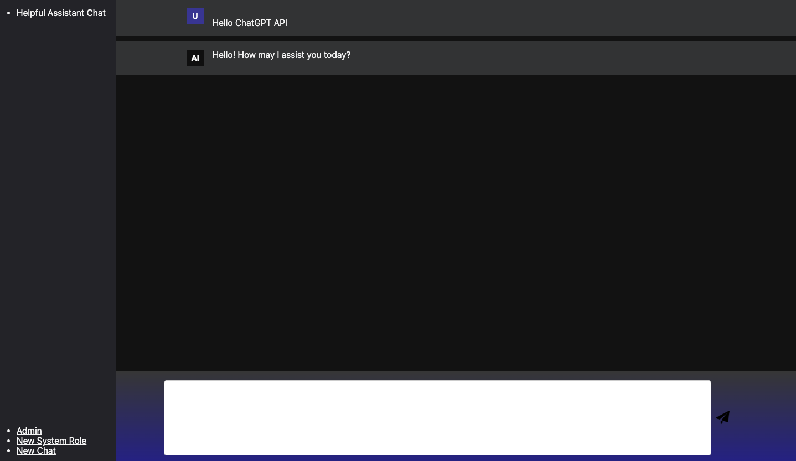

# ChatGPT_WebUI
Django based web interface for the ChatGPT API.

**Note: At the moment this is only a proof of concept and the server should not be exposed to the internet.**



## Setup
1. Install Docker and Docker Compose if you haven't already done so.
2. Clone the repository to your local machine.
3. Open a terminal and navigate to the root directory of the cloned repository.
4. Set the environment variable inside the docker-compose.yml CHAT_GPT_API_KEY to your OpenAI API key
5. Start the server `docker-compose up -d`
6. Open a web browser, navigate to http://127.0.0.1:8000 and login with username `admin` and password `admin`

Via http://127.0.0.1:8000/admin you can change the system role and the chat parameters for Temperature, 
Presence_Penalty and Frequency_Penalty.


## Setting Up Development Environment
To set up the development environment for the project, you'll need to follow these steps:

1. Clone the repository to your local machine using Git
2. Install the required packages by running pip install -r requirements.txt
3. Set the environment variables needed for development:
   - DEVELOPMENT=TRUE 
   - DJANGO_SETTINGS_MODULE=ChatGPT_WebUI.settings 
   - CHAT_GPT_API_KEY=<sk-openai-api-key>
4. Run the following commands to create the database and apply migrations:
```bash
python manage.py makemigrations
python manage.py migrate
```
5. Create a superuser by with `python manage.py createsuperuser`
6. Start the Django development server with `python manage.py runserver`
7. Open your web browser, navigate to http://127.0.0.1:8000/ and login
